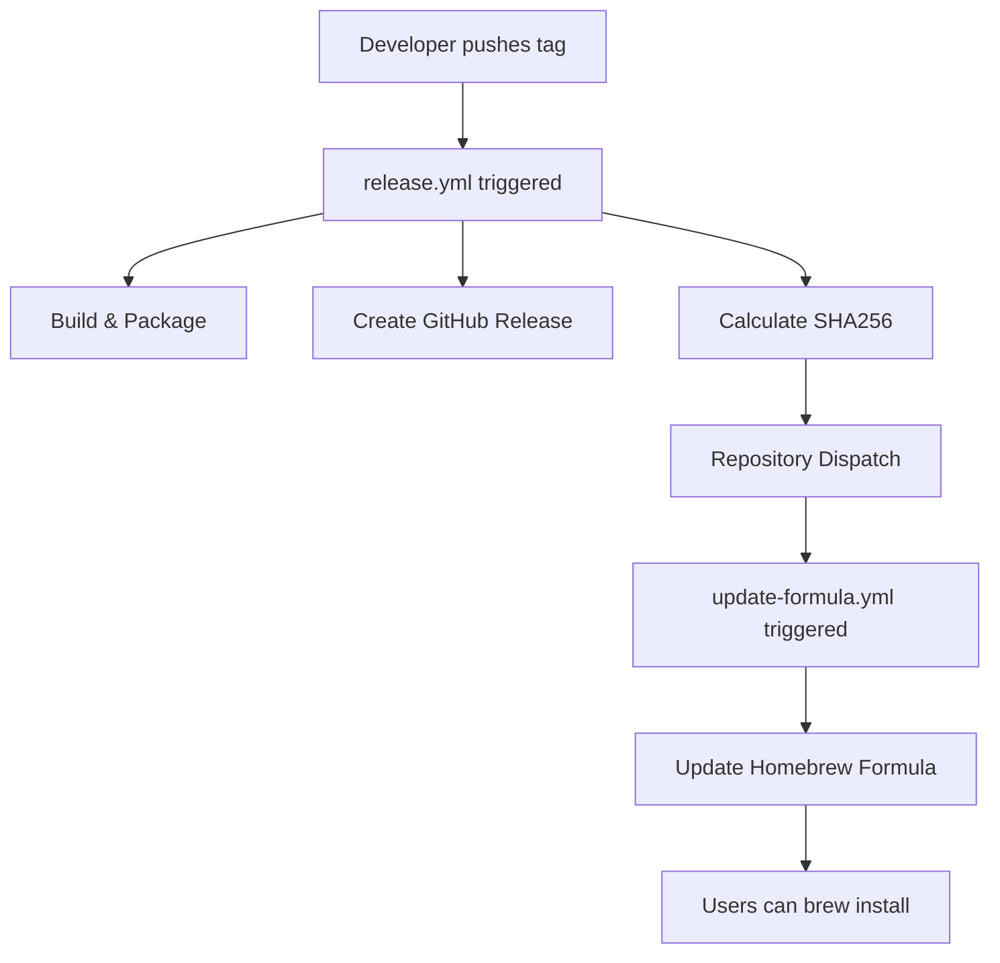

# GitHub Actions Automation

This document explains the GitHub Actions workflows that automate the Cheers release and distribution process.

## Workflow Overview



## Workflows

### 1. Release Workflow (cheers/.github/workflows/release.yml)

**Trigger**: Push of tags matching `v*` pattern

**Purpose**: Build, package, and release Cheers

**Key Steps**:

```yaml
name: Release

on:
  push:
    tags:
      - 'v*'

jobs:
  release:
    runs-on: macos-latest
    steps:
      # 1. Checkout code
      - uses: actions/checkout@v4
      
      # 2. Create GitHub Release
      - name: Create Release
        uses: softprops/action-gh-release@v2
        with:
          generate_release_notes: true
          make_latest: true
      
      # 3. Build Swift binary
      - name: Build
        run: |
          swiftc cheers.swift -o cheers \
            -framework UserNotifications \
            -framework AppKit
      
      # 4. Create app bundle structure
      - name: Create App Bundle
        run: |
          mkdir -p build/cheers.app/Contents/MacOS
          mkdir -p build/cheers.app/Contents/Resources
          cp cheers build/cheers.app/Contents/MacOS/
          # Create Info.plist
          # Copy icon if exists
      
      # 5. Code sign the bundle
      - name: Code Sign
        run: codesign -s - --force --deep build/cheers.app
      
      # 6. Package for distribution
      - name: Package
        run: tar -czf cheers-macos.tar.gz -C build .
      
      # 7. Upload to release
      - name: Upload Release Asset
        uses: softprops/action-gh-release@v2
        with:
          files: cheers-macos.tar.gz
      
      # 8. Calculate source SHA256
      - name: Calculate SHA256
        run: |
          SHA=$(curl -sL $SOURCE_URL | shasum -a 256 | cut -d' ' -f1)
          echo "SHA256=$SHA" >> $GITHUB_ENV
      
      # 9. Trigger formula update
      - name: Update Homebrew Formula
        run: |
          curl -X POST \
            -H "Authorization: token ${{ secrets.TAP_UPDATE_TOKEN }}" \
            -H "Accept: application/vnd.github.v3+json" \
            https://api.github.com/repos/xorvo/homebrew-tap/dispatches \
            -d '{"event_type":"update-formula","client_payload":{"version":"${{ github.ref_name }}","sha256":"${{ env.SHA256 }}"}}'
```

**Secrets Required**:
- `TAP_UPDATE_TOKEN`: Personal Access Token with repo scope

**Outputs**:
- GitHub Release with release notes
- `cheers-macos.tar.gz` artifact
- Repository dispatch event to tap repo

### 2. Formula Update Workflow (homebrew-tap/.github/workflows/update-formula.yml)

**Trigger**: Repository dispatch event `update-formula`

**Purpose**: Automatically update Homebrew formula with new version

**Key Steps**:

```yaml
name: Update Formula

on:
  repository_dispatch:
    types: [update-formula]

jobs:
  update:
    runs-on: ubuntu-latest
    steps:
      # 1. Checkout tap repository
      - uses: actions/checkout@v4
      
      # 2. Update formula file
      - name: Update Formula
        run: |
          VERSION="${{ github.event.client_payload.version }}"
          SHA256="${{ github.event.client_payload.sha256 }}"
          
          # Update URL
          sed -i "s|archive/refs/tags/v[0-9.]*\.tar\.gz|archive/refs/tags/${VERSION}.tar.gz|" \
            Formula/cheers.rb
          
          # Update SHA256
          sed -i "s|sha256 \"[a-f0-9]*\"|sha256 \"${SHA256}\"|" \
            Formula/cheers.rb
      
      # 3. Commit and push changes
      - name: Commit changes
        run: |
          git config user.name "github-actions[bot]"
          git config user.email "github-actions[bot]@users.noreply.github.com"
          git add Formula/cheers.rb
          git commit -m "Update Cheers to ${{ github.event.client_payload.version }}"
          git push
```

**Permissions**: Write access to repository (default for GITHUB_TOKEN)

**Outputs**:
- Updated Formula/cheers.rb
- Commit to main branch

## Security Configuration

### Personal Access Token (PAT)

Create a PAT for cross-repository communication:

1. Go to GitHub Settings → Developer settings → Personal access tokens
2. Create token with `repo` scope (or `public_repo` for public repos)
3. Add as secret `TAP_UPDATE_TOKEN` in cheers repository

### Repository Dispatch

Repository dispatch allows cross-repository triggering:

```bash
# Manual trigger example
curl -X POST \
  -H "Authorization: token $GITHUB_TOKEN" \
  -H "Accept: application/vnd.github.v3+json" \
  https://api.github.com/repos/xorvo/homebrew-tap/dispatches \
  -d '{"event_type":"update-formula","client_payload":{"version":"v1.4.0","sha256":"abc123..."}}'
```

## Workflow Permissions

### Release Workflow Permissions

```yaml
permissions:
  contents: write  # Create releases and upload assets
```

### Formula Update Workflow Permissions

Default permissions are sufficient (contents: write on own repo).

## Testing Workflows

### Act - Local GitHub Actions

Test workflows locally using [act](https://github.com/nektos/act):

```bash
# Install act
brew install act

# Test release workflow
act push --tag v1.4.0

# Test repository dispatch
act repository_dispatch
```

### Workflow Debugging

Enable debug logging:

1. Set repository secrets:
   - `ACTIONS_RUNNER_DEBUG`: `true`
   - `ACTIONS_STEP_DEBUG`: `true`

2. Re-run workflow for verbose output

## Monitoring and Maintenance

### Health Checks

1. **Release Workflow**:
   - Check: https://github.com/xorvo/cheers/actions
   - Verify release created
   - Confirm artifact uploaded

2. **Formula Update**:
   - Check: https://github.com/xorvo/homebrew-tap/actions
   - Verify formula updated
   - Test installation

### Common Issues

#### Release workflow fails at build

**Cause**: Swift compilation error
**Fix**: Test build locally first
```bash
make build
```

#### Formula doesn't update

**Cause**: PAT expired or incorrect
**Fix**: Regenerate token and update secret

#### Repository dispatch not triggered

**Cause**: Network issue or GitHub API limit
**Fix**: Manually trigger or wait and retry

## Workflow Optimization

### Caching Dependencies

Add caching for faster builds:

```yaml
- uses: actions/cache@v4
  with:
    path: ~/Library/Caches/swift
    key: ${{ runner.os }}-swift-${{ hashFiles('*.swift') }}
```

### Matrix Builds

Test on multiple macOS versions:

```yaml
strategy:
  matrix:
    os: [macos-12, macos-13, macos-14]
runs-on: ${{ matrix.os }}
```

### Parallel Jobs

Split build and test into parallel jobs:

```yaml
jobs:
  build:
    # Build job
  test:
    needs: build
    # Test job
  release:
    needs: [build, test]
    # Release job
```

## Best Practices

### DO:
- ✅ Use specific action versions (`@v4` not `@latest`)
- ✅ Set timeouts for long-running jobs
- ✅ Use secrets for sensitive data
- ✅ Include error handling
- ✅ Generate release notes automatically

### DON'T:
- ❌ Hardcode versions in workflows
- ❌ Skip code signing step
- ❌ Use personal tokens in workflow files
- ❌ Ignore workflow failures
- ❌ Create releases without testing

## Advanced Features

### Conditional Releases

Only release on main branch:

```yaml
if: github.ref == 'refs/heads/main'
```

### Pre-release Support

Handle beta versions:

```yaml
- name: Create Release
  uses: softprops/action-gh-release@v2
  with:
    prerelease: ${{ contains(github.ref, 'beta') }}
```

### Changelog Generation

Auto-generate from commits:

```yaml
- name: Generate Changelog
  uses: orhun/git-cliff-action@v3
  with:
    config: cliff.toml
    args: --latest --strip header
```

### Notification on Failure

Send notification when workflow fails:

```yaml
- name: Notify Failure
  if: failure()
  run: |
    cheers -t "Build Failed" \
           -m "Release ${{ github.ref_name }} failed" \
           --sound Basso \
           -o "${{ github.server_url }}/${{ github.repository }}/actions/runs/${{ github.run_id }}"
```

## Future Enhancements

Potential workflow improvements:

1. **Automated Testing**
   - Run test suite before release
   - Integration tests with actual notifications

2. **Multi-Architecture Builds**
   - Build for Intel and Apple Silicon
   - Create universal binary

3. **Release Drafts**
   - Create draft releases for review
   - Manual approval before publishing

4. **Homebrew Bottle Building**
   - Pre-compile for common configurations
   - Upload bottles to GitHub Releases

5. **Security Scanning**
   - Scan for vulnerabilities
   - Code signing with Developer ID

6. **Performance Metrics**
   - Track workflow execution time
   - Optimize slow steps

## Workflow Files Reference

### Environment Variables

Available in all workflows:
- `${{ github.ref_name }}` - Tag name (e.g., "v1.4.0")
- `${{ github.sha }}` - Commit SHA
- `${{ github.repository }}` - "owner/repo"
- `${{ github.actor }}` - User who triggered

### Useful Actions

- `actions/checkout@v4` - Checkout code
- `softprops/action-gh-release@v2` - Create releases
- `actions/upload-artifact@v4` - Upload artifacts
- `actions/cache@v4` - Cache dependencies

### Debugging Commands

Add to workflow for debugging:
```yaml
- name: Debug Info
  run: |
    echo "Ref: ${{ github.ref }}"
    echo "SHA: ${{ github.sha }}"
    echo "Event: ${{ github.event_name }}"
    echo "Payload: ${{ toJSON(github.event) }}"
```