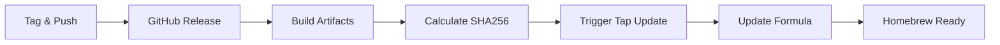

# Release Process

This document describes the release process for Cheers and how it integrates with Homebrew distribution.

## Overview

The release process is fully automated through GitHub Actions, with automatic updates to the Homebrew tap repository.

## Release Flow



## Creating a New Release

### Quick Release (Recommended)

Use the justfile command for a one-step release:

```bash
# Create and push a new release
just release 1.4.0
```

This command will:
1. Create a git tag with the version
2. Push the tag to GitHub
3. Trigger the automated release workflow

### Manual Release Process

If you prefer to release manually:

```bash
# 1. Tag the release
git tag -a v1.4.0 -m "Release v1.4.0 - Description of changes"

# 2. Push the tag
git push origin v1.4.0
```

## Automated Pipeline

### 1. Release Workflow (.github/workflows/release.yml)

When a tag is pushed, this workflow:

1. **Creates GitHub Release**
   - Generates release notes
   - Marks as latest release

2. **Builds Release Artifacts**
   - Compiles the Swift binary
   - Creates app bundle structure
   - Adds Info.plist and icon
   - Code signs the bundle
   - Creates tarball package

3. **Calculates Source SHA256**
   - Downloads source tarball
   - Computes SHA256 hash
   - Stores for formula update

4. **Triggers Tap Repository**
   - Sends repository dispatch event
   - Includes version and SHA256
   - Uses PAT for cross-repo access

### 2. Tap Update Workflow (homebrew-tap/.github/workflows/update-formula.yml)

When triggered by repository dispatch:

1. **Updates Formula**
   - Modifies URL to new version
   - Updates SHA256 hash
   - Preserves formula structure

2. **Commits Changes**
   - Creates descriptive commit
   - Pushes to main branch

## Version Numbering

Follow semantic versioning (MAJOR.MINOR.PATCH):

- **MAJOR**: Breaking changes
- **MINOR**: New features, backwards compatible
- **PATCH**: Bug fixes, backwards compatible

Examples:
- `1.0.0` - Initial stable release
- `1.1.0` - Added new sound support
- `1.1.1` - Fixed notification bug
- `2.0.0` - Major rewrite or breaking CLI changes

## Pre-Release Checklist

Before creating a release:

- [ ] Test the binary locally: `make build && make test`
- [ ] Verify help text is accurate: `./build/cheers.app/Contents/MacOS/cheers --help`
- [ ] Test notification with URL: `cheers -t "Test" -m "Click me" -o "https://example.com"`
- [ ] Check icon displays correctly
- [ ] Verify all sounds work
- [ ] Update README if needed
- [ ] Commit all changes

## Release Notes Template

```markdown
## What's Changed

### Features
- Added support for X
- Improved Y performance

### Bug Fixes
- Fixed issue with Z
- Resolved notification clicks not working

### Documentation
- Updated README with new examples
- Added guide for custom sounds

### Internal
- Refactored notification handler
- Improved error messages

**Full Changelog**: https://github.com/xorvo/cheers/compare/v1.3.0...v1.4.0
```

## Troubleshooting

### Release Workflow Fails

If the release workflow fails:

1. Check GitHub Actions logs
2. Verify PAT token hasn't expired
3. Ensure swift build works locally
4. Check for syntax errors in workflows

### Homebrew Tap Not Updating

If the formula doesn't update automatically:

1. Check the tap repository's Actions tab
2. Verify repository dispatch was sent
3. Manually trigger if needed:
   ```bash
   curl -X POST \
     -H "Authorization: token $GITHUB_TOKEN" \
     -H "Accept: application/vnd.github.v3+json" \
     https://api.github.com/repos/xorvo/homebrew-tap/dispatches \
     -d '{"event_type":"update-formula","client_payload":{"version":"1.4.0","sha256":"..."}}'
   ```

### Users Report Installation Issues

Common solutions:

```bash
# Update Homebrew
brew update

# Reinstall tap
brew untap xorvo/tap
brew tap xorvo/tap

# Reinstall cheers
brew uninstall cheers
brew install cheers
```

## Security Considerations

### GitHub Token (PAT)

The Personal Access Token needs:
- `repo` scope for private repos
- `public_repo` scope for public repos
- Set to never expire or renew regularly
- Stored as `TAP_UPDATE_TOKEN` secret

### Code Signing

- Uses ad-hoc signing (`codesign -s -`)
- Prevents Gatekeeper warnings
- No Developer ID required

## Manual Formula Update

If automation fails, update manually:

1. Calculate SHA256:
   ```bash
   curl -L https://github.com/xorvo/cheers/archive/refs/tags/v1.4.0.tar.gz | shasum -a 256
   ```

2. Edit formula in homebrew-tap repo:
   ```ruby
   url "https://github.com/xorvo/cheers/archive/refs/tags/v1.4.0.tar.gz"
   sha256 "new_sha256_here"
   ```

3. Test locally:
   ```bash
   brew install --build-from-source Formula/cheers.rb
   ```

4. Commit and push:
   ```bash
   git add Formula/cheers.rb
   git commit -m "Update Cheers to v1.4.0"
   git push
   ```

## Monitoring Releases

### Health Checks

- GitHub Releases page: https://github.com/xorvo/cheers/releases
- Homebrew tap commits: https://github.com/xorvo/homebrew-tap/commits/main
- Installation test: `brew install xorvo/tap/cheers`

### User Feedback Channels

- GitHub Issues: https://github.com/xorvo/cheers/issues
- Formula issues: https://github.com/xorvo/homebrew-tap/issues

## Rollback Procedure

If a release has critical issues:

1. **Don't delete the release** (breaks Homebrew)
2. Create a new patch release with the fix
3. If urgent, manually update formula to point to previous version
4. Communicate to users via GitHub Issues

## Future Improvements

Potential enhancements to the release process:

- [ ] Automated testing before release
- [ ] Changelog generation from commits
- [ ] Beta/pre-release channel
- [ ] Automated formula PR instead of direct commit
- [ ] Release signing with Developer ID
- [ ] Analytics on download counts